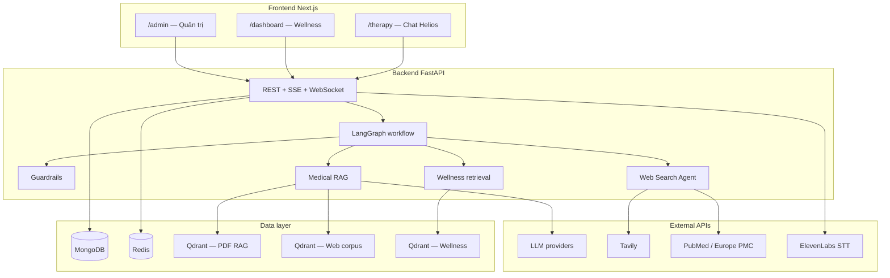

# Helios — Tra cứu & tư vấn sức khỏe tâm thần

Monorepo cho **Helios** — nền tảng hỗ trợ tra cứu và tư vấn **sức khỏe tâm thần** với AI đa agent, RAG trên tài liệu y khoa, tìm kiếm web (Tavily/PubMed), guardrails an toàn nội dung, và bài tập wellness trong app.

Dự án luận văn **IT4995 — Bachelor Thesis**.

---

## Mục lục

- [Tổng quan](#tổng-quan)
- [Tính năng chính](#tính-năng-chính)
- [Kiến trúc hệ thống](#kiến-trúc-hệ-thống)
- [Luồng xử lý tin nhắn (LangGraph)](#luồng-xử-lý-tin-nhắn-langgraph)
- [Công nghệ sử dụng](#công-nghệ-sử-dụng)
- [Yêu cầu hệ thống](#yêu-cầu-hệ-thống)
- [Cấu trúc thư mục](#cấu-trúc-thư-mục)
- [Cài đặt & chạy local](#cài-đặt--chạy-local)
- [Cấu hình môi trường](#cấu-hình-môi-trường)
- [Knowledge base & ingest](#knowledge-base--ingest)
- [API](#api)
- [Giao diện người dùng](#giao-diện-người-dùng)
- [Admin panel](#admin-panel)
- [Phát triển & kiểm thử](#phát-triển--kiểm-thử)
- [Tài liệu thêm](#tài-liệu-thêm)

---

## Tổng quan

Helios là chatbot tư vấn sức khỏe tâm thần, **không thay thế bác sĩ**. Hệ thống:

- Trả lời câu hỏi về cảm xúc, stress, lo âu, trầm cảm, trị liệu tâm lý (CBT, v.v.) dựa trên corpus đã ingest.
- Từ chối chủ đề ngoài phạm vi (y học thể chất, thú y, trivia) qua **input guardrails**.
- Khi corpus không đủ, fallback sang **web search** (Tavily + PubMed/Europe PMC).
- Gợi ý **wellness activities** (thở, thư giãn, mindfulness) kèm nút mở bài tập trong app.
- Hỗ trợ **handoff** sang chuyên viên (human support) qua admin.

---

## Tính năng chính

| Nhóm | Mô tả |
|------|--------|
| **Multi-agent LangGraph** | Route agent chọn conversation / RAG / web search; tách sub-query (tối đa 4) cho retrieve song song |
| **RAG (Qdrant)** | PDF y khoa + web corpus mental health; hybrid dense + BM25; rerank CrossEncoder local |
| **Web search** | Tavily (tin y tế) + PubMed/Europe PMC (bài báo) |
| **Guardrails** | Kiểm tra input/output; phạm vi **mental health only**; phát hiện ngôn ngữ (vi/en) |
| **Wellness** | Catalog hoạt động, vector search riêng, rating sau khi hoàn thành |
| **Auth** | JWT, đăng ký/đăng nhập, quên mật khẩu, liên kết session |
| **Handoff** | User yêu cầu → admin join phiên chat trực tiếp |
| **Speech** | Speech-to-text qua ElevenLabs (tùy chọn) |
| **Admin** | Quản lý PDF, crawl web, index Qdrant, users, conversations, wellness |
| **LLM đa provider** | Groq, OpenAI, Gemini, Ollama local, Modal endpoint |

---

## Kiến trúc hệ thống



---

## Luồng xử lý tin nhắn (LangGraph)

```
User message
    → analyze_input (input guardrails + ngôn ngữ + handoff)
    → route_to_agent (chọn agent + sub_queries nếu RAG)
    → CONVERSATION_AGENT | RAG_AGENT | WEB_SEARCH_PROCESSOR_AGENT
    → apply_guardrails (output safety + dịch vi/en)
    → (tùy chọn) gắn wellness activity buttons
```

**RAG agent (multi-query):**

1. Route agent trả `sub_queries` (1–4 câu tiếng Anh, mỗi câu một intent).
2. Retrieve + rerank **song song** cho từng sub-query (PDF + web corpus).
3. Dedupe chunk theo `doc_id`, cap `context_limit`, generate với **câu hỏi gốc** của user.

**Phạm vi guardrails:** chỉ sức khỏe tâm thần — câu hỏi y học thể chất/thú y (ví dụ dịch tả lợn) bị chặn ở input guard.

---

## Công nghệ sử dụng

| Layer | Stack |
|-------|--------|
| Backend | Python 3.11+, FastAPI, LangChain, LangGraph, Motor (MongoDB), Redis |
| RAG | Qdrant, FastEmbed (BM25), sentence-transformers (reranker), Docling/OpenAI parse |
| Frontend | Next.js 14 (App Router), React, Tailwind, shadcn/ui |
| Infra | Docker Compose (backend + frontend + Redis); MongoDB Atlas |
| Auth | JWT (PyJWT), bcrypt |

---

## Yêu cầu hệ thống

- **Python** ≥ 3.11
- **Node.js** ≥ 18 (khuyến nghị 20+)
- **Docker** & Docker Compose (hoặc chạy local)
- **MongoDB Atlas** (cloud — không cần mongo local)
- Ít nhất **một API key LLM** (Groq hoặc OpenAI hoặc Gemini)
- Tùy chọn: Ollama (embedding local), Tavily, PubMed email, ElevenLabs, Cloudinary (upload ảnh chat)

---

## Cấu trúc thư mục

```
├── backend/                    FastAPI + LangGraph
│   ├── app/
│   │   ├── api/                REST routes (chat, auth, admin, ws)
│   │   ├── medical/            Helios multi-agent workflow
│   │   │   ├── agents/         conversation, RAG, web search, guardrails, wellness
│   │   │   ├── ingest/         PDF ingest pipeline
│   │   │   └── config.py       RAG / agent / guardrails config
│   │   ├── crawl/              Web crawl staging & chunking
│   │   ├── auth/               JWT, password reset
│   │   ├── conversation/       Summary, memory context
│   │   └── handoff/            Human support messages
│   ├── data/
│   │   ├── medical/            PDF raw, Qdrant, docstore, metadata
│   │   └── crawl/              Web staging & catalog
│   ├── scripts/                Seed wellness, crawl, create admin
│   └── tests/                  Pytest (local only, gitignored)
│
├── frontend/                   Next.js app
│   ├── app/
│   │   ├── therapy/            Chat Helios (session-based)
│   │   ├── dashboard/          Lịch sử wellness & ratings
│   │   ├── admin/              Admin shell (knowledge, users, support)
│   │   └── api/                BFF routes proxy tới backend
│   └── components/             Chat, therapy, activities, admin UI
│
├── docker-compose.yml          Backend + Frontend + Redis (MongoDB Atlas)
└── .env.example                Pointer tới backend/.env.example
```

---

## Cài đặt & chạy local

### Cách nhanh — Docker (một lệnh)

```bash
cp backend/.env.example backend/.env   # điền MONGO_URI Atlas + API keys
docker compose up -d --build
```

- Frontend: [http://localhost:3000](http://localhost:3000)
- Backend Swagger: [http://localhost:8000/docs](http://localhost:8000/docs)
- MongoDB: **Atlas** (cấu hình `MONGO_URI` trong `backend/.env`; thêm IP máy vào Atlas Network Access)
- Redis: container `redis` (port `6379`)

Lần build đầu có thể mất vài phút (cài dependency Python + build Next.js). Model reranker HuggingFace được cache trong volume `hf_cache`.

### Chạy từng phần (dev)

#### 1. Infrastructure

```bash
docker compose up -d redis
```

- Redis: `localhost:6379`

#### 2. Backend

```bash
cd backend
python3 -m venv .venv
source .venv/bin/activate          # Windows: .venv\Scripts\activate
pip install -e ".[dev,medical]"
cp .env.example .env               # điền API keys (xem bảng bên dưới)
uvicorn app.main:app --reload --host 0.0.0.0 --port 8000
```

- Swagger UI: [http://localhost:8000/docs](http://localhost:8000/docs)
- Health: backend log in LLM provider + embedding provider khi startup

#### 3. Frontend

```bash
cd frontend
npm install
# Tùy chọn: tạo frontend/.env.local
# NEXT_PUBLIC_API_URL=http://127.0.0.1:8000
npm run dev
```

- App: [http://localhost:3000](http://localhost:3000)
- Chat Helios: [http://localhost:3000/therapy](http://localhost:3000/therapy)

### 4. Tạo admin (lần đầu)

```bash
cd backend
source .venv/bin/activate
python scripts/create_admin_user.py
# Hoặc set BOOTSTRAP_ADMIN_EMAIL trong .env rồi đăng ký qua UI
```

### 5. Ingest knowledge base (nếu chưa có vector)

```bash
# PDF từ data/medical/raw/
python -m app.medical.ingest --dir data/medical/raw

# Wellness activities vào Qdrant
python scripts/seed_wellness_activities.py --ingest-qdrant
```

Chi tiết ingest, crawl web, env vars: [backend/README.md](backend/README.md).

---

## Cấu hình môi trường

File mẫu đầy đủ: [backend/.env.example](backend/.env.example)

### Bắt buộc / quan trọng

| Biến | Mô tả |
|------|--------|
| `MONGO_URI` | MongoDB connection string |
| `JWT_SECRET` | Secret ký JWT (chuỗi dài ngẫu nhiên) |
| `GROQ_API_KEY` hoặc `OPENAI_API_KEY` hoặc `GOOGLE_API_KEY` | Ít nhất một LLM provider |
| `CORS_ORIGINS` | Origin frontend, mặc định `http://localhost:3000` |

### RAG & embedding

| Biến | Mô tả |
|------|--------|
| `EMBEDDING_PROVIDER` | `openai` hoặc `ollama` (mặc định auto) |
| `OLLAMA_BASE_URL` | URL Ollama nếu dùng embedding local |
| `HUGGINGFACE_TOKEN` | Token tải reranker model |
| `RAG_MAX_SUB_QUERIES` | Số sub-query tối đa (mặc định `4`) |

### Web search

| Biến | Mô tả |
|------|--------|
| `TAVILY_API_KEY` | Tavily search |
| `ENABLE_TAVILY_SEARCH` | Bật/tắt Tavily |
| `ENABLE_PUBMED_SEARCH` | Bật/tắt PubMed |
| `PUBMED_EMAIL` | Email bắt buộc cho NCBI E-utilities |

### Guardrails & handoff

| Biến | Mô tả |
|------|--------|
| `ENABLE_INPUT_GUARDRAILS` | Kiểm tra phạm vi + an toàn input (khuyến nghị `true`) |
| `ENABLE_OUTPUT_GUARDRAILS` | Kiểm tra + localize output |
| `FRONTEND_URL` | URL frontend cho link reset password |

### Frontend (tùy chọn)

| Biến | Mô tả |
|------|--------|
| `NEXT_PUBLIC_API_URL` | Backend URL (mặc định `http://127.0.0.1:8000`) |
| `BACKEND_API_URL` | Dùng trong Next.js API routes (server-side) |

---

## Knowledge base & ingest

Helios dùng **ba** nguồn vector riêng trên Qdrant:

| Collection | Nội dung | Đường dẫn |
|------------|----------|-----------|
| PDF RAG | Sách/tài liệu y khoa đã parse | `backend/data/medical/raw/` → ingest |
| Web corpus | Bài viết mental health đã crawl | Admin → Knowledge → Crawl & Index |
| Wellness | Hoạt động thư giãn trong app | `scripts/seed_wellness_activities.py` |

Metadata PDF (title, topics): `backend/data/medical/document_metadata.json`

**Lưu ý:** Thư mục `qdrant_db/`, `parsed_docs/`, `docs_db/` thường nằm trong `.gitignore` — cần ingest lại trên máy mới.

---

## API

Prefix: `/api/v1` — Auth: `Authorization: Bearer <jwt>` (tùy endpoint).

### Chat & session

| Method | Endpoint | Mô tả |
|--------|----------|--------|
| `POST` | `/chat` | Gửi tin nhắn, nhận reply Helios |
| `POST` | `/chat/stream` | SSE: progress steps + response cuối |
| `GET` | `/messages?session_id=` | Lịch sử tin nhắn |
| `GET` | `/conversations` | Danh sách phiên chat |
| `DELETE` | `/conversations/{session_id}` | Xóa phiên |
| `POST` | `/handoff/request` | Yêu cầu kết nối chuyên viên |

### Wellness & activities

| Method | Endpoint | Mô tả |
|--------|----------|--------|
| `GET` | `/activities/catalog` | Danh mục hoạt động |
| `POST` | `/wellness/start` | Bắt đầu bài tập trong phiên chat |
| `POST` | `/wellness/complete` | Hoàn thành bài tập |
| `POST` | `/activities/rate` | Đánh giá sao sau khi làm |

### Auth

| Method | Endpoint | Mô tả |
|--------|----------|--------|
| `POST` | `/auth/register` | Đăng ký |
| `POST` | `/auth/login` | Đăng nhập → JWT |
| `GET` | `/auth/me` | Thông tin user hiện tại |
| `POST` | `/auth/forgot-password` | Gửi link reset |
| `POST` | `/auth/link-session` | Gắn session ẩn danh với tài khoản |

### Admin (`/api/v1/admin/...`)

Yêu cầu role admin — quản lý PDF upload/ingest, crawl web, index jobs, users, conversations (support queue), wellness CRUD.

---

## Giao diện người dùng

| Route | Mô tả |
|-------|--------|
| `/` | Landing page |
| `/therapy` | Tạo phiên chat mới |
| `/therapy/[sessionId]` | Chat Helios — markdown, nguồn RAG, nút wellness, voice input |
| `/dashboard` | Lịch sử hoạt động wellness & rating |
| `/login`, `/signup` | Xác thực |
| `/about`, `/features` | Giới thiệu tính năng |

---

## Admin panel

Truy cập: [http://localhost:3000/admin](http://localhost:3000/admin)

| Mục | Chức năng |
|-----|-----------|
| **Overview** | Thống kê hệ thống |
| **Knowledge** | Upload PDF, ingest, crawl web, build index Qdrant |
| **Wellness** | CRUD activities, reindex vector |
| **Conversations** | Xem phiên user; **Support queue** — join/leave handoff |
| **Users** | Quản lý tài khoản |
| **Settings** | Snapshot cấu hình runtime, usage |

---

## Phát triển & kiểm thử

```bash
# Backend tests (thư mục backend/tests — local only)
cd backend && source .venv/bin/activate && pytest

# Frontend lint
cd frontend && npm run lint
```

**Gợi ý debug:**

- Bật log agent: xem console backend khi chat (`Selected agent: RAG_AGENT`, `RAG sub-queries: [...]`).
- `WELLNESS_AGENT_DEBUG=1` — trace wellness retrieval.
- Swagger `/docs` — thử API trực tiếp.

---

## Tài liệu thêm

- [backend/README.md](backend/README.md) — ingest PDF, crawl, scripts, env chi tiết
- [backend/app/medical/agents/README.md](backend/app/medical/agents/README.md) — nguồn tài liệu RAG tham khảo

---

## Lưu ý pháp lý & y đức

Helios cung cấp **thông tin hỗ trợ** về sức khỏe tâm thần, **không phải chẩn đoán hay điều trị y khoa**. Người dùng trong khủng hoảng hoặc có ý định tự hại cần liên hệ đường dây nóng / chuyên gia tại địa phương.
